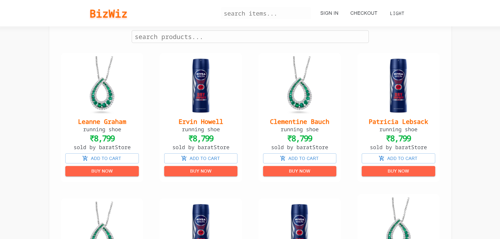

# About BizWiz

1. Here you can compare products details and prices from different websites

2. Purpose of this project is to showcase my development skills if not doing actual buisness,
this is full fleged projects lists products and deals from different e-commerce plateform like Flipkart, Amazon, Myntra, etc. and compare prices and reviews about different sellers.
and will be redirected to official websites.

## Objective of project

This project uses fetching data from APIs and deploy it to front end. this process taught me how to fetch data and handle errors.
how to search data while recieving
how to query data with specific query 
how to connect data with users 
managing states in react application 
managing user Authentication

## Tech Stack Used
1. Front End built on react and material ui 
2. Authentication with
3. fake payment api/system with 

Check It out Live here **[jdbiziwz.netlify.app](https://jdbiz.netlify.app/)**.

